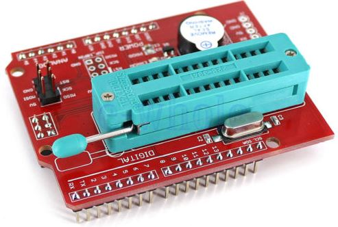
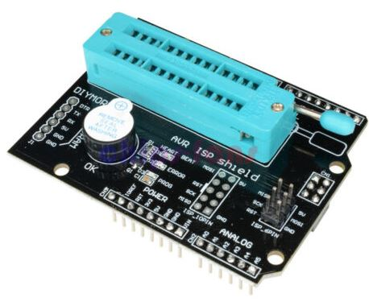
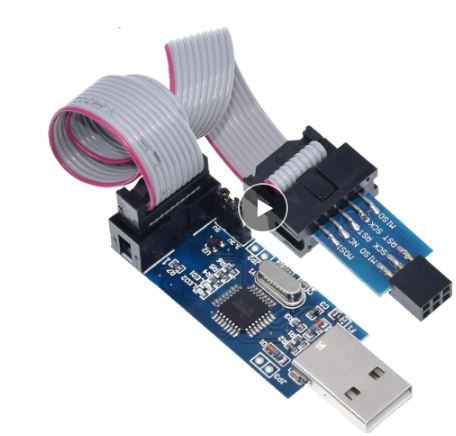

# #167 Low Voltage Project plus LED lighting?
#### If your project runs on 1.8v how do you light an LED requiring at least 2.1 volts?

### See https://youtube.com/ralphbacon video #167
#### Direct link to video: https://youtu.be/gx7SG5ClvCQ

#### Add $8 off your first order at LCSC Electronics with https://lcsc.com/?href=ralphsbacon&source=referral

Do you have a low voltage (possibly battery powered) project but you still want to use an LED indicator (or even an LCD that requires both power and backlighting). Where do you begin?

See this video to get a very quick (3 components) method of allowing this. Whilst this is, in effect, a Diode Pump, it's part of a bigger set of circuits that allow voltage doubling and tripling. It sounds counter-intuitive but the laws of physics definitely allow this!

### List of all my videos
(Special thanks to Michael Kurt Vogel for compiling this)  
http://bit.ly/YouTubeVideoList-RalphBacon

### Product Links

Official (as it can be) OPEN SMART AVR ISP Shield Bootloader Programmer with buzzer and LED indicator  
http://s.click.aliexpress.com/e/snN0a5Ws  

**Red programming shield** that I found on eBay (UK link but available worldwide):  
https://www.ebay.co.uk/itm/AVR-ISP-Shield-Burning-Bootloader-Programmer-for-Arduino-UNO-R3-WT-/172443238667

  

Ali Express **Black version** of the AVR ISP Shield (there are several):  
http://s.click.aliexpress.com/e/dADT1zf2  
 

  

AliExpress **USBASP programmer** a steal at under $2 (look around for others):   
http://s.click.aliexpress.com/e/mI7VMddq or  
http://s.click.aliexpress.com/e/ouak0z72   

Banggood's USBASP v2.0 programmer (NB you need a 10-pin to 6-pin adapter see next item):  
https://www.banggood.com/USBASP-USBISP-AVR-Programmer-USB-ISP-USB-ASP-ATMEGA8-ATMEGA128-Support-Win7-64K-p-1497716.html?p=FQ040729393382015118&utm_campaign=25129675&utm_content=3897  

**10-pin to 6-pin adapter**, for Banggood's USBASP programmer, just over $1:  
https://www.banggood.com/10-Pin-To-6-Pin-Adapter-Board-Connector-For-Arduino-ISP-Interface-Converter-AVR-AVRISP-USBASP-STK500-Standard-p-1413166.html?p=FQ040729393382015118&utm_campaign=25129675&utm_content=3897  

Geekcreit **FT232RL FTDI USB To TTL Serial Converter** Adapter Module For Arduino:  
https://www.banggood.com/FT232RL-FTDI-USB-To-TTL-Serial-Converter-Adapter-Module-For-Arduino-p-917226.html?p=FQ040729393382015118&utm_campaign=25129675&utm_content=3897

If you like this video please give it a thumbs up, share it and if you're not already subscribed please consider doing so and joining me on my Arduinite journey

My channel and blog are here:  
\------------------------------------------------------------------  
https://www.youtube.com/RalphBacon  
https://ralphbacon.blog  
\------------------------------------------------------------------
